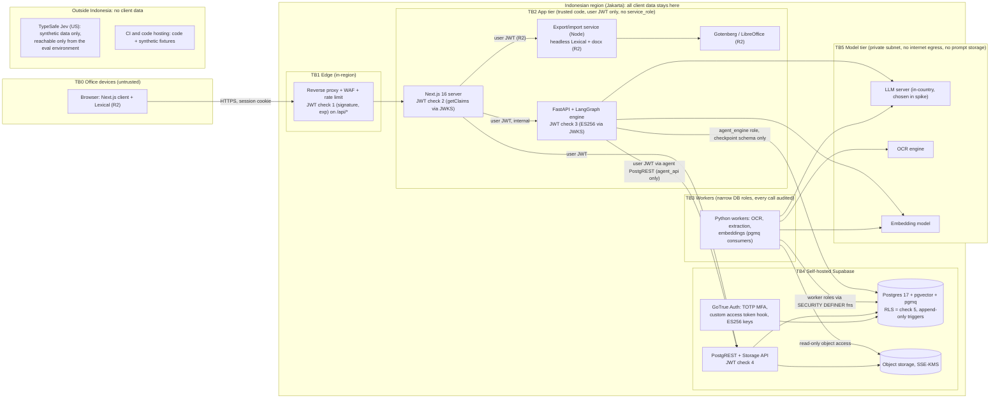
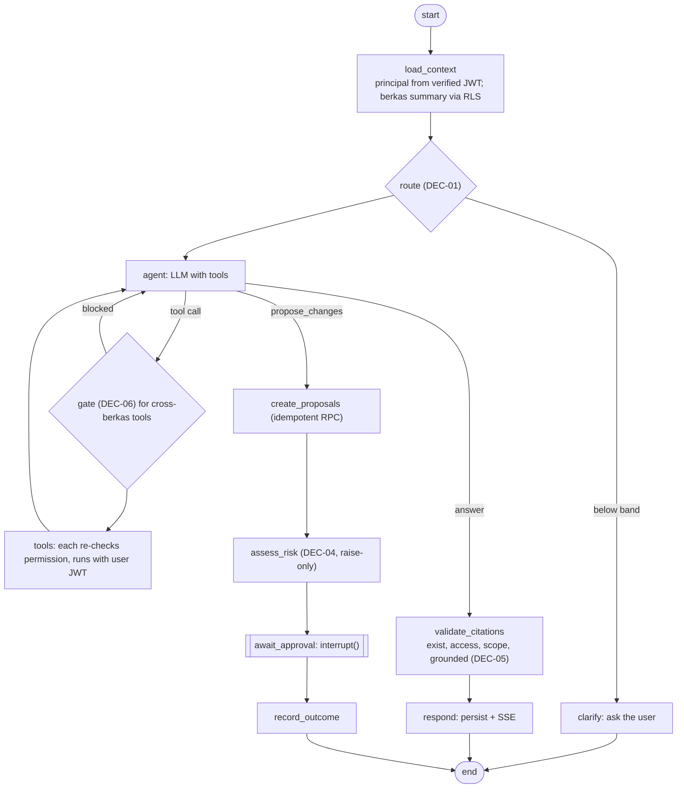

# Verity: Implementation Plan (v0.1, approved 2026-09-25)

> Approved by the owner on 2026-09-25. Implementation starts with Phase 0 (§11). Open decisions are in §13.
> Sources: `docs/PRD.md` v1.0, `docs/TRD.md` v1.2, `docs/design/berkas-workspace.jsx`. Where the PRD and TRD conflict, the TRD wins on technical matters and the PRD wins on scope and behavior. Conflicts are listed in §2, not resolved silently.

## Context and decisions taken in this session

Owner answers (2026-09-25) that change the TRD baseline:

| Topic | Answer | Consequence |
| --- | --- | --- |
| Officials | One person who is both Notaris and PPAT | Two appointments: separate numbering and registers for Notaris akta and PPAT akta, both owned by one user |
| Legacy data | Import everything: numbering seed, active berkas, historical registers | Migration workstream in R1a. Append-only tables need a controlled one-time import path |
| Templates | Clean `.docx` templates exist | R2 template import is feasible (REQ-ED-06) |
| Firm vs notary | Strictly separate | Two tenants: `kantor_notaris` and `firma`. No shared person or company records |
| Residency | **All client data stays in Indonesia, including transient model inference** | Supabase Cloud is out (no Jakarta region), so Supabase is self-hosted in Jakarta. Claude API, Jev, OpenRouter and Pinecone cannot receive client data. LLM, OCR and embeddings must run in Indonesia |
| Jev terms | Nothing yet | Jev runs on synthetic data only, and stays that way unless TypeSafe offers processing in Indonesia |
| LLM provider | Undecided | Only in-country paths qualify: Bedrock in-region models in Jakarta, self-hosted open weights on Jakarta GPUs, or an Indonesian provider with written terms. Spike S1 picks the model; LLM sits behind an abstraction |
| Co-editing | No, single editor with a lock | No Yjs in R2 |
| Team / date | 1–2 full-stack devs, R1 before end of 2026 | R1 is split into R1a (Dec 2026) and R1b (Q1 2027) |
| Rule verification | Staff draft, Notaris signs off | `verified_by` must hold the `notaris` role (DB check) |
| R1 drafting | Word draft uploaded as a versioned document | Lexical editor stays in R2 |
| Approvals | Atomic proposals, split by required approver | One `ProposedChange` = one approval tier, all-or-nothing |
| Name | Verity | Code, UI and repository use "Verity" |

---

## 1. Summary

Verity is an internal workspace for one Indonesian office that houses a Notaris/PPAT practice and, as a strictly separate tenant, a non-litigation law firm. Every client matter is a **berkas**: one place for the parties (linked to deduplicated person and company records), uploaded documents with OCR and human-verified extracted fields, the akta and its status lifecycle, checklist, deadlines and activity. The system of record generates the legally significant registers (repertorium, klapper, daftar protokol, and the PPAT register) as append-only data and assigns gapless akta numbers only at finalization. On top of that sits a read-only AI agent. It answers questions about the berkas with server-validated, clickable citations, flags mismatches between documents, and, when something should change, drafts a `ProposedChange` that only a human with the right role can approve. It can never finalize, number, sign or send an akta. Jev (a typed decision model) may only tighten controls (raise approval tiers, block tool calls, flag low confidence), never loosen them. In R2 the office drafts akta in a Lexical editor from its own versioned templates, with party data rendered from verified fields, agent suggestions shown as track changes, and server-side `.docx`/PDF export in the office format. The UI is in Bahasa Indonesia and follows the calm "legal paper and notary-stamp violet" mockup. All client data, including model inference, stays in Indonesia.

---

## 2. Conflicts and ambiguities

Status: **R** = resolved by an owner answer this session, **P** = proposed resolution needing sign-off, **N** = question for the Notaris (see §13.3).

| ID | Where | Conflict or ambiguity | Status and proposal |
| --- | --- | --- | --- |
| C-01 | PRD title vs TRD title and mockup sidebar | "Verity" vs "NotarisDigital" | R: Verity |
| C-02 | Mockup header "Akta 010/2026", sheet "Nomor: 010" on a draft vs PRD-R-03 and REQ-SOR-02 (number only at finalization) | Number shown before finalization | P: drafts show "Nomor: —". N: confirm when the number is assigned and its format |
| C-03 | Mockup proposal "Ubah status akta 010/2026 dari Intake ke Draft" vs REQ-SOR-01 statuses (Draft → Verifikasi → Menunggu TTD → Selesai → Diarsipkan) | "Intake" is not an akta status | P: "Intake" is a berkas workflow step. An akta record is born in `draft` |
| C-04 | Mockup activity "Agen membuat draft akta" and checklist item done by "Agen" vs REQ-AI-02 | Agent appears to write directly | P: the draft exists only after an approved `ProposedChange`. Activity shows "Agen mengusulkan … disetujui oleh {nama}" |
| C-05 | PRD §6 R1 outcome ("intake to final akta in the system") vs editor and draft-from-template in R2, while mockup shows agent drafting | How akta text is produced in R1 | R: in R1 the draft is a versioned `.docx` uploaded to the berkas |
| C-06 | Mockup draft uses the intake address ("No. 21") as free text vs REQ-ED-01 | Party data typed, not bound to verified fields; two *verified* sources (KTP, intake verified by Retno) disagree | P: persons hold one canonical value per field, chosen from verified fields by a precedence rule. N: which source wins per field |
| C-07 | Mockup card bundles draft text, checklist and akta status under one notaris approval | Mixed approval tiers in one card | R: atomic proposals split by required approver |
| C-08 | PRD-A-02 and REQ-FE-03 (R1) need mismatch severity; DEC-03 (severity) is planned for R2 | Severity needed before DEC-03 exists | P: R1 uses a config table `mismatch_severity_rules` (Notaris-verified). DEC-03 later can only raise severity |
| C-09 | REQ-AI-06(c) groundedness is needed with the first agent (R1b); DEC-05 is planned for R2 | Groundedness check needed earlier | P: R1b runs DEC-05 through `DecisionProvider` with the in-country LLM judge plus a deterministic number, NIK and date match; Jev is evaluated on synthetic data only |
| C-10 | PRD-H-03 (who, human or agent, read what) vs REQ-SOR-04 (logs agent reads only) | Human reads not in TRD audit scope | P: log human and agent document reads (PRD wins on behavior) |
| C-11 | PRD-B-02 (R1) header shows nearest deadline and workflow steps; deadline rules and workflows are R2 | R1 has no rule engine | P: R1 shows manually entered deadlines and a per-type step list from config. Mockup's "Batas pengajuan AHU: 24 Nov 2026" must carry "belum terverifikasi" unless it comes from a verified rule |
| C-12 | PRD §6 puts the Beranda approval queue in R2; approvals ship in R1 (REQ-FE-04) | Where pending approvals are seen in R1 | P: R1b includes a minimal "Menunggu persetujuan saya" list |
| C-13 | REQ-AI-01 and REQ-AI-07 list routes and tools for R2/R3 (drafting, contract review, research, templates, knowledge) | Not release-tagged | P: tool and route sets are tagged per release (§7.3) |
| C-14 | PRD §4 lets Associates approve administrative changes; REQ-AI-03 names only "Staf" | Associate approval rights | P: firm tenant: associate = staf tier for administrative changes on their berkas |
| C-15 | REQ-AI-03 "Notaris approves changes to … register" vs REQ-SOR-03 append-only | What a register "change" is | P: only correction entries that reference the original entry, created by a Notaris-approved proposal |
| C-16 | PRD and TRD describe only Notaris registers and "per notaris per year" numbering; AJB is a PPAT act | PPAT numbering and register not specified | P: numbering and registers keyed by official appointment (Notaris or PPAT). N: formats, reset periods, PPAT registers and reports |
| C-17 | PRD §4: Super Admin manages berkas membership and sees audit log | Super Admin could add themselves to any berkas | P: Super Admin sees metadata and audit but no client content; self-assignment is blocked and every membership change notifies the Notaris |
| C-18 | PRD §4: only the Notaris sees all berkas | Partner supervising associates may need all firm berkas | P: follow PRD (assigned only). Ask the owner |
| C-19 | Self-approval not addressed | Can the user who asked the agent approve its proposal? | P: yes if they hold the required role (the agent is the proposer). N: four-eyes for register corrections? |
| C-20 | TRD §2 Next.js 15 | Next.js 15 is in maintenance LTS until 2026-10-21; 16.x is Active LTS | P: Next.js 16 (TRD deviation) |
| C-21 | TRD §2 and §7 Supabase (implies Supabase Cloud), region [KEPUTUSAN] | Supabase Cloud has no Jakarta region | R (by residency): self-hosted Supabase in Jakarta |
| C-22 | TRD §2 Cloudflare edge (WAF, rate limit, JWT check) vs "all data in Indonesia" | Cloudflare terminates TLS and sees plaintext; Indonesia is not a Cloudflare data-localization region | P: WAF, rate limit and JWT check 1 move to an in-region edge; Cloudflare only as DNS or L4 passthrough (D-09) |
| C-23 | TRD §3.4: Score is an ordinal "level"; `state` limit ~32k | Docs: Score returns a probability-weighted float plus distribution; Noul has no `confidence`; 32k covers state plus the longest question, 64k per request | P: bands use the distribution, not a single level |
| C-24 | TRD §3.4 says Jev early access 15 Sep 2026 | TypeSafe blog opening early access is dated 24 Sep 2026; SDK 0.6.0 shipped 15 Sep | Informational |
| C-25 | REQ-ED-05 leaves `python-docx` vs Node `docx` open | `python-docx` has no public API for numbering definitions | P: Node `docx` in an export service using the same Lexical node package |
| C-26 | NFR-SEC-02 requires RLS on LangGraph checkpoints | The Postgres checkpointer connects with one DB role, not the user's JWT | P: deny-all RLS for API roles, dedicated `agent_engine` role, encrypted checkpoints, thread access gated by an RLS-protected `agent_threads` lookup. Flagged as a deviation |
| C-27 | REQ-GW-04 (engine uses the user JWT) | Long runs outlive a JWT; resume after approval arrives with the approver's JWT | P: after resume the graph only records the outcome and ends the turn; new tool calls need a new user turn |
| C-28 | TRD job queue: Celery/RQ/Arq | All three need a broker (Redis) | P: Postgres-backed queue (pgmq), no extra datastore |
| C-29 | TRD vector publik: pgvector or Pinecone | Queries to a public corpus can contain client context | R (by residency): pgvector only |
| C-30 | TRD does not name an embedding model; NFR-SEC-01 lists embeddings as a processor | Missing decision | P: self-hosted multilingual embedding model (§13) |
| C-31 | Mockup calls `api.anthropic.com` from the browser and loads Google Fonts from a CDN | Prototype shortcuts | P: all model calls go through the engine; fonts self-hosted |
| C-32 | PRD-W-03 (agent proposes checklist items) is R2 but the mockup shows it in the R1 flow | Release of this op | P: `checklist.add` is a proposal op in R1b (small) |
| C-33 | Numbering "per year": which calendar and timezone | UTC vs WIB at year boundary | P: period computed from the akta date in the official's timezone (Asia/Jakarta) |

---

## 3. Verified facts / Unverified

Checked 2026-09-25 against live documentation. WebFetch summarizes pages, so load-bearing details must be re-checked at implementation time.

### 3.1 Verified

**Jev / TypeSafe**
- Endpoint `POST https://api.typesafe.ai/v1/systemone`, header `Authorization: Bearer <key>`. Body: `state` (string, object or array), `model` (required), `questions` (map of id → question). Response: `model`, `answers`, `usage`; request id in header `x-typesafe-request-id`. https://docs.typesafe.ai/api.md
- Question types: `noul` (`instructions`, optional `criteria` true/false), `choice` (`criteria` map, max 255 options), `score` (`criteria` ordered array of 2–10 levels). Answers: choice → `choice`, `probabilities`, `confidence`; score → `score` (probability-weighted float), `legend`, `probabilities`, `confidence`; noul → `noul` (0–1) only. https://docs.typesafe.ai/api.md, https://docs.typesafe.ai/primitives/score.md
- Questions in one request share the state and are evaluated independently and in parallel. https://docs.typesafe.ai/primitives.md
- "Jev-1.13 is not trained to generate text"; score levels are "weak in numerical calibration". https://docs.typesafe.ai/model-jaggedness/jev-1.13.md
- Confidence reflects how concentrated the distribution is; thresholds "depend on your domain". https://docs.typesafe.ai/confidence.md
- Models: `jev-1.13.0`; aliases `jev-latest` and `jev-preview` → `jev-1.13.0`. Docs advise pinning the version ID when thresholds are tuned. Limits: 64k tokens per request, 32k for `state` plus the longest question, text only. Rate limits 250k tokens/s and 1,200 req/min, subject to change. https://docs.typesafe.ai/models.md
- Python SDK `typesafe-sdk` 0.7.1 (2026-09-21, Python ≥3.10): `TypeSafeClient` / `AsyncTypeSafeClient`, `system_one(state, questions, *, model, retry, timeout, response_model)`. Defaults: model `jev-latest`, timeout 10 s, `RetryPolicy` max 2 retries within a 30 s budget. https://pypi.org/project/typesafe-sdk/, https://docs.typesafe.ai/sdk/python/api/constants.md, https://docs.typesafe.ai/sdk/python/api/retries.md
- `langchain-typesafe` 0.0.1a3 (alpha): `TypeSafeClassifier` Runnable plus experimental middleware. https://pypi.org/project/langchain-typesafe/
- OpenRouter lists `typesafe/jev-1.13`. https://openrouter.ai/typesafe
- Privacy policy: no training on Input; "The Services are hosted in the United States." https://typesafe.ai/legal/privacy-policy. DPA: retention "as long as necessary". https://typesafe.ai/legal/data-processing. Zero data retention "for enterprise customers" via sales. https://docs.typesafe.ai/legal.md. Customer agreement: early access, no uptime warranty. https://typesafe.ai/legal/mca

**Lexical**
- Current `lexical` 0.51.0 (2026-09-17); npm packages are ESM-only; `LexicalComposer` deprecated in favour of `LexicalExtensionComposer`. https://github.com/facebook/lexical/releases/tag/v0.51.0
- Extendable nodes: `ElementNode`, `TextNode`, `DecoratorNode`. New `$config()` API generates clone and JSON methods. https://lexical.dev/docs/concepts/nodes
- DecoratorNode defaults `isInline()` true, `isKeyboardSelectable()` true; `isIsolated()` blocks caret traversal and deletion. TextNode `token` mode is deleted as one unit. Source at v0.51.0 and https://lexical.dev/docs/concepts/nodes
- `@lexical/mark`: `MarkNode` with id arrays, `$wrapSelectionInMarkNode(selection, isBackward, id)`, `$unwrapMarkNode`; overlapping marks supported. https://lexical.dev/docs/api/modules/lexical_mark
- Serialization: `editorState.toJSON()`, `editor.parseEditorState()`; the per-node `version` field is deprecated and ignored. `@lexical/headless` runs in Node; `withDOM` provides a DOM for server-side HTML import. https://lexical.dev/docs/serialization/, https://lexical.dev/docs/packages/lexical-headless
- HTML import: `$generateNodesFromDOM`, custom `importDOM` conversion maps. https://lexical.dev/docs/serialization/
- Collaboration via `@lexical/yjs` needs a WebSocket server. https://lexical.dev/docs/collaboration/react
- No official track-changes or `.docx` package in v0.51.0 (confirmed by absence). https://api.github.com/repos/facebook/lexical/contents/packages?ref=v0.51.0

**LangGraph**
- `langgraph` 1.2.12; `langgraph-checkpoint-postgres` 3.1.2. https://pypi.org/project/langgraph/
- `from langgraph.types import interrupt, Command`; needs a checkpointer and `thread_id`; **on resume the node restarts from the top**, so code before `interrupt()` re-runs; several interrupts in a node are matched by index. https://docs.langchain.com/oss/python/langgraph/interrupts
- `AsyncPostgresSaver`; `.setup()` creates `checkpoint_migrations`, `checkpoints`, `checkpoint_blobs`, `checkpoint_writes`; connections need `autocommit=True`, `row_factory=dict_row`; `EncryptedSerializer.from_pycryptodome_aes()`; `delete_thread()`. https://docs.langchain.com/oss/python/langgraph/checkpointers
- Durability modes `exit | async | sync`; stream modes include `updates`, `messages`, `custom`; `graph.stream_events(..., version="v3")` is the recommended streaming API. https://docs.langchain.com/oss/python/langgraph/streaming

**Supabase**
- RLS: wrap `auth.uid()` / `auth.jwt()` in `(select …)`; security definer helpers in a non-exposed schema with `set search_path = ''`; index policy columns. https://supabase.com/docs/guides/database/postgres/row-level-security
- Custom Access Token Hook adds claims readable via `auth.jwt()`. https://supabase.com/docs/guides/auth/auth-hooks/custom-access-token-hook
- MFA: TOTP; enforce with a restrictive policy on `auth.jwt()->>'aal' = 'aal2'`. https://supabase.com/docs/guides/auth/auth-mfa
- Asymmetric signing keys (ES256 recommended); JWKS at `/auth/v1/.well-known/jwks.json`; JWKS cached up to 10 min at the edge. https://supabase.com/docs/guides/auth/signing-keys
- "RLS is enforced based on the `Authorization` header and not the `apikey` header." https://supabase.com/docs/guides/troubleshooting/why-is-my-service-role-key-client-getting-rls-errors-or-not-returning-data-7_1K9z
- New `sb_publishable_…` / `sb_secret_…` keys (secret maps to `service_role`, BYPASSRLS); legacy keys deprecated by end of 2026. https://supabase.com/docs/guides/api/api-keys
- pgvector HNSW; index dims up to 2,000 (`vector`) / 4,000 (`halfvec`); hybrid search with RRF. https://supabase.com/docs/guides/ai/vector-indexes/hnsw-indexes, https://supabase.com/docs/guides/ai/hybrid-search
- Storage access via RLS on `storage.objects`, helper `storage.foldername()`. https://supabase.com/docs/guides/storage/security/access-control
- Regions: no Jakarta; Singapore `ap-southeast-1` is the nearest. https://supabase.com/docs/guides/platform/regions
- Queues built on pgmq. https://supabase.com/docs/guides/queues. pgaudit documented. https://supabase.com/docs/guides/database/extensions/pgaudit

**LLM provider research (Claude, the model the mockup calls)**
- Current models: `claude-fable-5-1`, `claude-opus-5-5`, `claude-sonnet-5`, `claude-haiku-4-5-20251001`. https://platform.claude.com/docs/en/about-claude/models/overview
- Structured outputs via `output_config.format` (GA) and `strict: true` tools; Pydantic via `messages.parse`. https://platform.claude.com/docs/en/build-with-claude/structured-outputs
- ZDR by sales agreement; Batch and Files APIs not ZDR-eligible; Fable 5.1 requires 30-day retention; flagged content may be kept up to 2 years even under ZDR. https://platform.claude.com/docs/en/manage-claude/api-and-data-retention
- `inference_geo` only `"us"` or `"global"`; workspace geo only `"us"`. https://platform.claude.com/docs/en/manage-claude/data-residency
- Bedrock in Jakarta routes Claude through global cross-Region inference (inference may run outside Indonesia). https://aws.amazon.com/blogs/machine-learning/global-cross-region-inference-for-latest-anthropic-claude-opus-sonnet-and-haiku-models-on-amazon-bedrock-in-thailand-malaysia-singapore-indonesia-and-taiwan/. Vertex regional endpoints only serve Sonnet 4.6 and earlier; newer models use global or `us`/`eu`. https://platform.claude.com/docs/en/build-with-claude/claude-on-vertex-ai
- **Conclusion:** no current Claude deployment path keeps inference inside Indonesia, so Claude is excluded for client data under the residency decision.

**Frontend and export**
- Next.js 16.3.6 current; Next.js 15 maintenance LTS ends 2026-10-21; `middleware.ts` renamed `proxy.ts`. https://nextjs.org/support-policy, https://nextjs.org/blog/next-16
- shadcn/ui targets Tailwind v4 with OKLCH CSS variables. https://ui.shadcn.com/docs/tailwind-v4
- `docx` (npm) 9.7.2: numbering definitions, tab stops with leaders, section margins, tracked-change runs. https://docx.js.org
- `python-docx` 1.2.0: no public numbering-definition API. https://python-docx.readthedocs.io/en/latest/
- Gotenberg 8.37: `POST /forms/libreoffice/convert`. https://gotenberg.dev/docs/convert-with-libreoffice/convert-to-pdf
- mammoth 1.12: keeps headings, lists, tables; drops fonts, sizes and colours. https://github.com/mwilliamson/python-mammoth

**Self-hosted Supabase**
- Docker Compose is the only official self-hosting method; Kubernetes/Helm is community-supported. https://supabase.com/docs/guides/self-hosting, https://github.com/supabase-community/supabase-kubernetes
- Self-hosted supports the Custom Access Token hook and TOTP MFA via `GOTRUE_HOOK_CUSTOM_ACCESS_TOKEN_*` and `GOTRUE_MFA_TOTP_*` env vars (present in the official compose file), ES256 signing keys with JWKS at `/auth/v1/.well-known/jwks.json`, and one `sb_publishable` / one `sb_secret` key. https://raw.githubusercontent.com/supabase/supabase/master/docker/docker-compose.yml, https://supabase.com/docs/guides/self-hosting/self-hosted-auth-keys
- The `supabase/postgres` image (PG 17.6) includes pgvector 0.8.0, pgmq 1.4.4, pg_cron 1.6.4, pgsodium, supabase_vault. https://github.com/supabase/postgres
- Storage supports S3-compatible backends (`STORAGE_BACKEND: s3`, `GLOBAL_S3_*`). https://supabase.com/docs/guides/self-hosting/self-hosted-s3
- Not provided self-hosted: managed backups and PITR, branching, multiple projects; we own HA, backups and monitoring. https://supabase.com/docs/guides/self-hosting
- HTTPS needs our own reverse proxy (the default Envoy gateway is plain HTTP); never expose Envoy admin port 9901. https://supabase.com/docs/guides/self-hosting/self-hosted-proxy-https, https://supabase.com/docs/guides/self-hosting/self-hosted-envoy
- RDS for PostgreSQL in Jakarta offers pgvector and pg_cron but not pgmq, pg_net or pgsodium. https://docs.aws.amazon.com/AmazonRDS/latest/PostgreSQLReleaseNotes/postgresql-extensions.html

**Cloudflare**
- Data Localization Suite is an Enterprise add-on; Regional Services keeps TLS termination, WAF and Workers in-region, but **Indonesia is not an available region** (Singapore, India, Japan and others are). Customer Metadata Boundary covers only US and EU. https://developers.cloudflare.com/data-localization/region-support/
- API Shield JWT validation supports ES256 but needs keys uploaded (no JWKS URL fetch) and is Enterprise-only. https://developers.cloudflare.com/api-shield/security/jwt-validation/
- Origin response timeout is 125 s (error 524). https://developers.cloudflare.com/fundamentals/reference/connection-limits/

**Indonesian regions and in-country AI**
- AWS `ap-southeast-3` (Jakarta, 3 AZs, opt-in) has EKS, RDS and S3. https://docs.aws.amazon.com/global-infrastructure/latest/regions/aws-regions.html. GCP `asia-southeast2` and Azure Indonesia Central also exist with managed Postgres and object storage. https://docs.cloud.google.com/sql/docs/postgres/locations, https://learn.microsoft.com/en-us/azure/reliability/regions-list
- **Amazon Bedrock processes these models in-region in Jakarta:** Nova Pro and Lite, DeepSeek V3.2 and V3.1, Qwen3 235B A22B 2507, Qwen3 32B, Qwen3 Coder models, GLM 4.7 and 5, gpt-oss-120b and 20b, Kimi K2.5, Nemotron 3 Super 120B, MiniMax M2.1 and M2.5, Devstral 2. All current Claude models are global cross-Region only there. https://docs.aws.amazon.com/bedrock/latest/userguide/models-region-compatibility.html
- Bedrock default: zero data retention and no operator access; exceptions apply only to specific models (e.g. GPT-5.x flagged traffic, Claude Fable) that are not on the Jakarta in-region list. https://docs.aws.amazon.com/bedrock/latest/userguide/abuse-detection.html
- Google's generative AI has no Jakarta model endpoint and no Indonesian ML-processing commitment. https://docs.cloud.google.com/gemini-enterprise-agent-platform/resources/data-residency. Azure's model availability tables list no deployment in Indonesia Central (its products page shows "Foundry Models: Preview", unclear). https://learn.microsoft.com/en-us/azure/foundry/foundry-models/concepts/models-sold-directly-by-azure-region-availability
- Local hosted LLM APIs: Lintasarta Cloudeka "Deka LLM" states hosting "entirely in Indonesia" (Gemma 4, Nemotron 3 Super, Qwen3.5). https://www.cloudeka.id/en/products/deka-llm-en/. Biznet Gio NEO Inference states services run in Indonesia. https://www.biznetgio.com/blog/press-release-ai-services/
- GPUs in Jakarta: AWS G5, G7e, P5, P5e, P5en, P6-B300 (https://docs.aws.amazon.com/ec2/latest/instancetypes/ec2-instance-regions.html); GCP T4 and RTX PRO 6000 (https://docs.cloud.google.com/compute/docs/regions-zones/gpu-regions-zones); Azure A100, H100, A10.
- vLLM 0.30.0: JSON-schema structured outputs and tool calling. https://docs.vllm.ai/en/latest/features/structured_outputs.html, https://docs.vllm.ai/en/latest/features/tool_calling.html
- No managed OCR in Indonesia: Google Document AI, AWS Textract and Azure Document Intelligence have no Indonesian location. https://docs.cloud.google.com/document-ai/docs/regions, https://docs.aws.amazon.com/general/latest/gr/textract.html. Self-hostable: PaddleOCR 3.7 (PP-OCRv5 Latin model lists Indonesian, Apache-2.0), Tesseract 5.5.3 (`ind` data), docTR 1.1; Surya weights carry a revenue-limited licence. https://www.paddleocr.ai/latest/en/version3.x/algorithm/PP-OCRv5/PP-OCRv5_multi_languages.html
- No managed embeddings in Jakarta on the three clouds. Self-hostable: BAAI bge-m3 (MIT, 1024 dims, 8192 tokens), multilingual-e5-large (MIT, 1024), Qwen3-Embedding (Apache-2.0). https://huggingface.co/BAAI/bge-m3
- Open models stating Indonesian support: Nemotron-SEA-LION-v4.8 (MIT), Llama-Sahabat-AI-v2-70B-IT (Llama 3.1 licence), Llama 4 Scout (metadata). https://huggingface.co/aisingapore/Nemotron-SEA-LION-v4.8-120B-A12B, https://huggingface.co/GoToCompany/Llama-Sahabat-AI-v2-70B-IT

### 3.2 Unverified (treat as unknown)
- Jev: maximum questions per request; server-side timeout; idempotency; deprecation policy; sub-processors and certifications; any processing location other than the US; OpenRouter's data policy for Jev.
- Whether TypeSafe will offer processing in Indonesia.
- Postgres `indonesian` text-search configuration availability in the self-hosted image (plan assumes `simple` + `unaccent` until checked).
- Codegen tools: `datamodel-code-generator` (JSON Schema → Pydantic) and `json-schema-to-zod` current versions and draft-2020-12 support.
- Object Lock / WORM storage availability in the chosen Jakarta region.
- mammoth handling of multilevel numbering (1.1(a)) and headers/footers.
- Indonesian notarial practice details (numbering reset period, PPAT registers, retention of protokol): questions for the Notaris, §13.3.
- Bedrock: tool use and JSON-schema structured output for each Jakarta in-region model; how to technically prevent cross-Region inference profiles (IAM/SCP); Indonesian-language quality of each model (to be measured in spike S1).
- Retention, logging and training terms of Lintasarta Deka LLM and Biznet Gio NEO Inference (not stated on their pages).
- Token log-probabilities from the chosen serving path (needed for LLM-based decision probabilities).
- In-region WAF and managed load balancer availability in the chosen Jakarta region.
- Backup tooling (WAL-G or pgBackRest) compatibility with the `supabase/postgres` image outside Supabase's own hosting.
- Whether LangGraph persists any `configurable` run values in checkpoint metadata (the plan passes the JWT outside persisted config and tests for it).
- SSE through the non-Tunnel Cloudflare proxy (moot if Cloudflare does not terminate TLS).
- Azure "Foundry Models: Preview" in Indonesia Central: which models, if any.
- PostgREST v14 `db-schemas` and `db-pre-request` options for the separate agent PostgREST instance (long-standing PostgREST features, not re-checked this session).
- `pg_jsonschema` availability in the self-hosted `supabase/postgres` image.

---

## 4. Architecture

All client data lives and is processed in one Indonesian cloud region (Jakarta). Provider choice is open (D-01). AWS `ap-southeast-3`, GCP `asia-southeast2` and Azure Indonesia Central all offer managed Kubernetes, Postgres and object storage. I recommend AWS Jakarta because it is the only one with documented in-region managed LLMs (Bedrock) as well as H100-class GPUs for self-hosting. The model tier is therefore either Bedrock in-region model ids or vLLM on in-region GPUs, chosen in spike S1. OCR and embeddings are self-hosted because no managed service runs in Indonesia.



**Where each JWT is validated**

| # | Component | Check | Source of identity |
| --- | --- | --- | --- |
| 1 | Edge reverse proxy (in-region; Envoy `jwt_authn` or equivalent) | ES256 signature against JWKS, `exp`, `aud` on `/api/*` | Token only |
| 2 | Next.js server (`proxy.ts`, server actions, route handlers) | `supabase.auth.getClaims()` against JWKS; reject if `tenant_id` or `app_role` claims are missing | Claims |
| 3 | FastAPI dependency `get_principal()` | ES256 via cached JWKS (refetch on unknown `kid`), `exp`, `iss`, `aud`; builds `Principal(user_id, tenant_id, app_role, aal)` from claims only; client headers are never read for identity | Claims |
| 4 | PostgREST and Storage API | Re-verify the same JWT | Claims |
| 5 | Postgres RLS and RPC functions | `auth.jwt()` claims plus live membership and role tables (catches revoked roles before token expiry) | Claims + DB |

**Request paths**
- **Non-agent work** (berkas, parties, documents, registers, approvals): browser → Next.js server actions → PostgREST/RPC with the user's JWT. This path does not touch the engine, so NFR-REL-01 holds when the engine is down.
- **Agent**: browser → Next.js route handler `/api/agent/*` (same origin) → engine over the internal network with `Authorization: Bearer <user access token>` → SSE back through the same path.
- **Upload**: RPC `create_upload(berkas_id, …)` checks membership and returns a signed upload URL → Storage → DB row → pgmq job → worker.
- **Workers** never hold `service_role`. They use dedicated Postgres login roles (`worker_docs`, `worker_embed`) that can only execute specific `worker.*` SECURITY DEFINER functions, plus read-only object-store credentials scoped to the documents bucket. Each function writes an audit entry.
- **`service_role` / `sb_secret` key** is not deployed to any container. It exists only for break-glass administration from a bastion host, and each use is logged.
- **Cloudflare**: Indonesia is not a Cloudflare data-localization region, so a TLS-terminating Cloudflare proxy would process plaintext outside our residency guarantee. Proposal: in-region WAF and rate limiting in TB1; Cloudflare, if kept, only as DNS or L4 passthrough (no TLS termination). Decision D-09 in §13.

---

## 5. Repository layout and local development

```
verity/
├─ apps/
│  ├─ web/                 Next.js 16 App Router, Tailwind v4, shadcn/ui (TS)
│  ├─ engine/              FastAPI + LangGraph agent service (Python 3.12, uv)
│  ├─ workers/             OCR, extraction, embedding, calibration jobs (Python, pgmq)
│  └─ export/              R2: template import + .docx export (Node, @lexical/headless, docx)
├─ packages/
│  ├─ schema/              JSON Schema 2020-12 sources: ops, tool I/O, extraction, AgentAnswer, SSE events, DecisionSpec
│  ├─ schema-ts/           generated Zod + TS types (do not edit)
│  ├─ akta-nodes/          R2: Lexical node classes shared by web and export
│  └─ tokens/              design tokens from the mockup (CSS variables for shadcn)
├─ python/
│  ├─ verity_schema/       generated Pydantic v2 models (do not edit)
│  └─ verity_core/         auth (JWKS), PostgREST client with user JWT, DecisionProvider, logging with PII redaction
├─ supabase/
│  ├─ migrations/          SQL: tables, RLS, RPCs, triggers, seeds for approval policy
│  ├─ tests/               pgTAP: RLS isolation, append-only, numbering concurrency
│  └─ seed/                synthetic tenants, users, berkas (mockup data: PT Sinar Kopi Nusantara, AJB Cilandak)
├─ evals/                  agent fixtures, labeled decision sets (synthetic), calibration reports
├─ infra/                  docker compose (dev), IaC for Jakarta region, self-hosted Supabase config
└─ docs/                   PRD, TRD, PLAN, ADRs
```

- **Single-source schema:** hand-written JSON Schema in `packages/schema` is the only source. `pnpm gen:schema` produces Pydantic (via `datamodel-code-generator`) and Zod (via `json-schema-to-zod`). CI regenerates and fails on any diff. The DB validates op types against a whitelist inside RPCs; `pg_jsonschema` is used only if it is present in the self-hosted image (unverified).
- **Tooling:** pnpm workspaces + Turborepo (TS), uv workspace (Python), Ruff + mypy, ESLint + Vitest, pytest, pgTAP via `supabase test db`, Playwright.
- **Local dev:** `supabase start` (local stack, same images as self-hosted) + `docker compose -f infra/dev.yml up` for engine, workers, export, Gotenberg, a small local LLM or stub with the same OpenAI-compatible interface, and a fake `DecisionProvider`. Only synthetic data is allowed on laptops and in CI.
- **CI:** lint, typecheck, unit, pgTAP, schema drift, Playwright against the local stack, agent eval smoke set. Deploys to the Jakarta environment from CI with no client data leaving the region.

---

## 6. Database schema draft

**Conventions.** Every client-data table has `tenant_id uuid not null` and, where applicable, `berkas_id`. `public` holds API-exposed tables (RLS on, `revoke all from anon`, minimal grants to `authenticated`). `private` holds helper functions (not exposed). `worker` holds worker-only functions. `agent_state` holds LangGraph tables (not exposed). Tables are owned by a NOLOGIN role `verity_owner`; migrations run as that role.

**Tenancy and identity**

| Table | Key columns | Notes |
| --- | --- | --- |
| `tenants` | id, kind (`kantor_notaris`, `firma`), name | Two rows for this office |
| `tenant_members` | tenant_id, user_id, role (`notaris`, `partner`, `associate`, `staf_admin`, `super_admin`), active | Authority for roles; re-checked by privileged RPCs |
| `officials` | id, tenant_id, user_id, appointment (`notaris`, `ppat`), display_name, kedudukan, sk_ref, timezone | Sari Rahayu has two rows |
| `berkas_members` | berkas_id, user_id, tenant_id, added_by, active | Per-berkas access |

JWT claims (Custom Access Token Hook, supported self-hosted via `GOTRUE_HOOK_CUSTOM_ACCESS_TOKEN_*`): `tenant_id` (active tenant, verified against `tenant_members`), `app_role` (role in that tenant), plus standard `sub` and `aal`. A user in both tenants switches tenant through an RPC that updates `app_metadata.active_tenant_id` and forces a token refresh.

**System of record**

| Table | Key columns | Notes |
| --- | --- | --- |
| `persons` | id, tenant_id, nik_hmac (blind index), nik_enc, full_name, birth_place, birth_date, address fields, occupation, marital_status, canonical_sources jsonb | Canonical values; each points to the verified `extracted_fields` row it came from |
| `companies` | id, tenant_id, nib, name, legal_form, npwp_enc, domicile | |
| `berkas` | id, tenant_id, type, title, client_ref, pic_user_id, official_id, workflow_step, status | |
| `parties` | id, tenant_id, berkas_id, akta_id, person_id or company_id, party_role (`penghadap`, `pihak_pertama`, `pihak_kedua`, `kuasa`, `saksi`), capacity, sort_order | |
| `akta` | id, tenant_id, berkas_id, official_id, appointment, akta_type, status (`draft`, `verifikasi`, `menunggu_ttd`, `selesai`, `diarsipkan`), number (null until final), number_period, akta_date, finalized_at, finalized_by, current_draft_document_id (R1), current_draft_id (R2) | Column grants: `authenticated` cannot update `number`, `status`, `finalized_*` |
| `akta_status_history` | akta_id, from, to, actor, proposed_change_id, at | Append-only |
| `number_sequences` | official_id, appointment, period, last_value | PK (official_id, appointment, period); seeded from legacy data |
| `repertorium_entries` | id, tenant_id, official_id, period, entry_no, akta_id, akta_number, akta_date, sifat_akta, parties_summary, corrects_entry_id, source (`system`, `legacy_import`), import_batch_id, prev_hash, row_hash | Append-only |
| `klapper_entries` | id, tenant_id, official_id, repertorium_entry_id, indexed_name, initial_letter, period, corrects_entry_id | Append-only |
| `protokol_entries` | id, tenant_id, official_id, akta_id, bundle_ref, location, corrects_entry_id | Append-only; content to confirm with the Notaris |
| `ppat_register_entries` | id, tenant_id, official_id, period, entry_no, akta_id, object_ref, corrects_entry_id | Append-only; structure to confirm with the Notaris |
| `checklist_items`, `deadlines` | berkas_id, title, assignee, due_date, done, source (`manual`, `rule`, `proposal`), rule_id, verified | R1 manual deadlines |
| `deadline_rules` | id, tenant_id, name, regulation_ref, trigger, offset, status (`draft`, `verified`), drafted_by, verified_by, verified_at | R2. Check: `verified_by` must hold `notaris` (trigger); unverified rules never create deadlines |
| `mismatch_severity_rules` | tenant_id, field_key, akta_type, severity (`blocking`, `confirm`, `info`), regulation_ref, verified_by | R1 severity baseline, same verification rule |

**Documents and extraction**

| Table | Key columns | Notes |
| --- | --- | --- |
| `documents` | id, tenant_id, berkas_id, storage_path, sha256, mime, doc_type, doc_type_source (`staff`, `llm`, `jev_eval`), doc_type_confidence, ocr_status, retention_class (`working`, `protokol`) | Storage path `tenant/berkas/doc` enforced by `storage.objects` RLS |
| `document_versions` | document_id, version, storage_path, sha256, uploaded_by | R1 Word drafts are versions |
| `document_pages` | document_id, version, page_no, ocr_engine, ocr_confidence | No text here |
| `document_anchors` | id (stable uuid), tenant_id, berkas_id, document_id, version, kind (`field`, `block`, `pasal`), anchor_key, page_no, bbox, text, text_hash, embedding vector(d), tsv tsvector | Chunk = anchor (REQ-VEC-03). HNSW + GIN indexes |
| `extracted_fields` | id, tenant_id, berkas_id, document_id, anchor_id, field_key, value, null_reason, status (`unverified`, `verified`, `corrected`), extracted_by (model id or `manual`), verified_by, verified_at | History in `extracted_field_events` (append-only) |
| `mismatches` | id, berkas_id, subject_ref, field_key, left_field_id, right_field_id, severity, severity_source (`rule`, `llm`, `jev_eval`), status, resolved_by, resolution | |

**Agent, proposals, audit**

| Table | Key columns | Notes |
| --- | --- | --- |
| `agent_threads` | id, tenant_id, berkas_id, created_by, graph_thread_id, status, last_activity_at | Gate for checkpoint access |
| `agent_messages` | id, thread_id, role, content, citations jsonb (target, status), model_id | RLS via thread berkas |
| `agent_run_events` | run_id, seq, thread_id, type, payload | SSE resume via `Last-Event-ID`; short retention |
| `proposed_changes` | id, tenant_id, berkas_id, thread_id, idempotency_key (unique), items jsonb, base_versions jsonb, required_role, risk_note, status (`pending`, `applied`, `rejected`, `stale`, `expired`), created_by_agent_for (user_id) | Trigger: `required_role` rank can only increase |
| `approval_policies` | op_type, tenant_kind, min_role | Seeded by migration only |
| `approvals` | proposed_change_id (unique), decision, decided_by, decided_role, aal, reason, decided_at | Append-only |
| `decision_log` | dec_id, provider, model_id, request_id, question_ids, probabilities, thresholds_version, band, action, fallback, latency_ms | Never stores `state` |
| `decision_thresholds` | dec_id, provider, model_id, version, bands jsonb, approved_by, approved_at | Provider refuses to act without an approved row |
| `audit_log` | id, tenant_id, berkas_id, actor_type (`human`, `agent`, `worker`, `system`), actor_user_id, on_behalf_of, action, target_type, target_id, details jsonb (ids and numbers only), prev_hash, row_hash, occurred_at | Append-only, hash-chained |
| R2: `templates`, `template_versions`, `format_profiles`, `clauses`, `clause_versions`, `drafts`, `draft_versions` | see §9 | |

**RLS pattern** (every table above holding client data):

```sql
create function private.tenant_id() returns uuid language sql stable security definer set search_path = ''
  as $$ select nullif(auth.jwt()->>'tenant_id','')::uuid $$;
create function private.app_role() returns text language sql stable security definer set search_path = ''
  as $$ select auth.jwt()->>'app_role' $$;

create function private.can_access_berkas(p_berkas uuid) returns boolean
language sql stable security definer set search_path = '' as $$
  select exists (
    select 1 from public.berkas b
    where b.id = p_berkas and b.tenant_id = private.tenant_id()
      and ( ( private.app_role() = 'notaris'
              and exists (select 1 from public.tenant_members tm
                          where tm.tenant_id = b.tenant_id and tm.user_id = auth.uid()
                            and tm.role = 'notaris' and tm.active) )
         or exists (select 1 from public.berkas_members m
                    where m.berkas_id = b.id and m.user_id = auth.uid() and m.active) ) ) $$;

alter table public.document_anchors enable row level security;
create policy anchors_read on public.document_anchors for select to authenticated
  using ( tenant_id = (select private.tenant_id()) and private.can_access_berkas(berkas_id) );
-- MFA for privileged roles, on every client-data table:
create policy anchors_aal2 on public.document_anchors as restrictive for all to authenticated
  using ( (select private.app_role()) not in ('notaris','partner','super_admin')
          or (select auth.jwt()->>'aal') = 'aal2' );
```

- `super_admin` passes no `can_access_berkas` check, so it sees no client content; it gets separate policies on `tenant_members`, `berkas_members` (cannot add itself) and a metadata-only audit view.
- Document content tables (`document_anchors`, `extracted_fields`) live in a non-exposed `content` schema, so there is no direct REST endpoint for them. `authenticated` keeps `select` under RLS, so SECURITY INVOKER RPCs (`open_document()`, `read_anchors()`, `search_anchors()`) return only permitted rows, and each one logs `document.read` (human or agent) through the SECURITY DEFINER helper `private.audit()` (PRD-H-03).
- `storage.objects` policy: `(storage.foldername(name))[1] = private.tenant_id()::text and private.can_access_berkas(((storage.foldername(name))[2])::uuid)`.
- `agent_state.*` (checkpoints): RLS enabled with no policy for `anon`/`authenticated` (deny-all); only `agent_engine` can read or write; the engine loads a checkpoint only after an RLS-checked read of `agent_threads` with the user's JWT succeeds (C-26).

**Append-only mechanism** (registers, `audit_log`, `approvals`, `akta_status_history`, `extracted_field_events`):

```sql
revoke insert, update, delete, truncate on public.repertorium_entries from public, anon, authenticated, service_role;
create function private.reject_mutation() returns trigger language plpgsql as
  $$ begin raise exception '% is append-only', tg_table_name using errcode = '42501'; end $$;
create trigger repertorium_no_update before update or delete on public.repertorium_entries
  for each row execute function private.reject_mutation();
create trigger repertorium_no_truncate before truncate on public.repertorium_entries
  for each statement execute function private.reject_mutation();
```

Inserts happen only inside SECURITY DEFINER functions (`finalize_akta`, `correct_register_entry`, `import_legacy_registers`). Each row carries `prev_hash`/`row_hash` (per tenant and register chain, serialized with an advisory lock). A nightly job verifies the chains and copies chain heads to write-once storage in-region. A Postgres superuser can still bypass triggers; that residual risk is covered by pgaudit, hash-chain verification and restricted DB superuser access.

**Akta numbering at finalization** (REQ-SOR-02):

```sql
create function public.finalize_akta(p_akta_id uuid, p_akta_date date)
returns table (akta_number int, period text)
language plpgsql security definer set search_path = '' as $$
declare a public.akta; o public.officials; v_period text; v_no int;
begin
  select * into a from public.akta where id = p_akta_id for update;             -- lock the akta
  select * into o from public.officials where id = a.official_id;
  if a.tenant_id is distinct from private.tenant_id() or o.user_id <> auth.uid()
     or private.app_role() <> 'notaris' or (auth.jwt()->>'aal') <> 'aal2'
     or not private.has_active_role(a.tenant_id, 'notaris') then
    raise exception 'forbidden' using errcode = '42501';
  end if;
  if a.status <> 'menunggu_ttd' or a.number is not null then raise exception 'invalid state'; end if;
  v_period := private.numbering_period(o.id, a.appointment, p_akta_date);        -- computed in o.timezone; reset period per N-01
  insert into public.number_sequences as s (official_id, appointment, period, last_value)
       values (o.id, a.appointment, v_period, 1)
  on conflict (official_id, appointment, period) do update set last_value = s.last_value + 1
  returning last_value into v_no;                                                 -- row lock serializes concurrent calls
  perform set_config('verity.finalizing', p_akta_id::text, true);               -- guard trigger allows only this update
  update public.akta set number = v_no, number_period = v_period, akta_date = p_akta_date,
         status = 'selesai', finalized_at = now(), finalized_by = auth.uid()
   where id = p_akta_id;
  perform private.append_register_entries(p_akta_id);                           -- repertorium, klapper, PPAT register
  perform private.audit('akta.finalized', 'akta', p_akta_id,
                        jsonb_build_object('number', v_no, 'period', v_period));
  return query select v_no, v_period;
end $$;
```

- Gapless and never reused: the counter row and the akta update commit or roll back together; a unique constraint on `(official_id, appointment, number_period, number)` backs it up. A voided akta keeps its number and gets a correction entry.
- A `before update` trigger on `akta` rejects any change to `number`, or a move to `selesai`, unless `verity.finalizing` equals that akta id; `number` is immutable once set.
- Only a human Notaris session with MFA can call it. The engine has no tool that reaches it, and the proposal op whitelist excludes it (§10).
- Which transition is "finalization" (signing?) is question N-02.

**Legacy import** (all historical data): a one-time, audited `import_legacy_registers(batch jsonb)` SECURITY DEFINER function, callable only by a migration role from the bastion, marks rows `source = 'legacy_import'` with an `import_batch_id` and seeds `number_sequences` to the last legacy number per official, appointment and period. The function is dropped after cutover. Active berkas and persons are imported through the normal RPCs by a script with a reconciliation report (counts, duplicates by NIK).

---

## 7. Agent design

### 7.1 Graph (LangGraph, R1b)



- **Principal** (user_id, tenant_id, role, aal) comes from the verified JWT at request start and is passed in run context, never in graph input. The raw JWT is never written to state or checkpoints (a test scans checkpoint blobs for the token).
- **Interrupts**: only `await_approval` in R1b (R2 draft suggestions reuse it). `interrupt()` sits in its own node, so `create_proposals` never re-runs on resume. `create_proposals` is also idempotent (`idempotency_key = hash(thread_id, run_id, tool_call_id)`, `on conflict do nothing`), which satisfies NFR-REL-01.
- **Resume**: the UI calls `POST /v1/threads/{id}/resume` with the approver's JWT. The engine re-reads the proposal status through PostgREST with that JWT (never trusting the payload), then `Command(resume={pc_id: status})`. `record_outcome` writes "Disetujui oleh …" or "Ditolak" and ends the turn; further tool calls need a new user turn (C-27).
- **Checkpointer**: `AsyncPostgresSaver` on role `agent_engine` (search_path `agent_state`), `EncryptedSerializer` (AES key from the in-region KMS), `LANGGRAPH_STRICT_MSGPACK=true`, `durability="sync"` for runs that create proposals. A retention job calls `delete_thread()` after the retention period (§10, NFR-SEC-06).
- **Streaming**: `stream_events(version="v3")`, mapped to SSE events `step`, `token`, `citation.pending`, `citation.validated`, `proposal`, `done`, each with a sequence id stored in `agent_run_events` for resume after disconnect (REQ-FE-01). The first `step` event is sent before routing to meet NFR-PERF-01.

### 7.2 Tools

Every tool calls PostgREST/RPC with the requesting user's JWT (RLS applies) and re-checks scope in code. Tool I/O schemas live in `packages/schema`.

| Tool | Release | Input | Output | Permission and audit |
| --- | --- | --- | --- | --- |
| `get_berkas` | R1b | `{berkas_id}` | summary, parties, akta status, checklist, deadlines, record refs | RLS; must be the thread's berkas unless DEC-06 passes |
| `list_documents` | R1b | `{berkas_id}` | `[{document_id, doc_type, version, verified_fields}]` | RLS |
| `read_document` | R1b | `{document_id, anchor_ids? , page?}` | `[{anchor_id, kind, text, page}]` | `read_anchors` RPC; logs `document.read`, actor `agent`, on behalf of user |
| `search_documents` | R1b | `{query, berkas_id?, doc_types?, k ≤ 20}` | `[{anchor_id, snippet, score}]` | `search_anchors` RPC (SECURITY INVOKER, RLS) plus a re-check of each hit |
| `search_berkas` | R1b | `{query, filters?}` | `[{berkas_id, title, type, status}]` | Cross-berkas: DEC-06 gate first, then RLS |
| `query_register` | R1b | `{register, period?, party_name?, akta_type?}` | entries with record refs | RLS on register tables (Notaris, or member of the akta's berkas) |
| `compare_fields` | R1b | `{berkas_id, subject_ids?}` | `[{field_key, left, right, equal, rule_severity}]` with field and anchor ids | Deterministic code; normalization rules in config |
| `propose_changes` | R1b | `{berkas_id, items: Op[]}` | `{proposed_change_ids, required_roles}` | Pydantic op schema; RPC re-validates, splits by approver, computes `required_role` |
| `search_knowledge`, `get_template` | R2 | `{query, kind}` / `{template_id, version?}` | template and clause refs | Tenant RLS |
| `draft_from_template` | R2 | `{akta_id, template_version_id}` | `{proposed_change_id}` (op `draft.create`) | Party data only as `PartyFieldNode` references |
| `review_contract`, `search_law` | R3 | — | — | — |

**Op whitelist** (JSON Schema, versioned): `checklist.add`, `checklist.update`, `deadline.add_manual`, `berkas.update_meta`, `party.link`, `person.set_canonical_field` (must reference a verified `extracted_fields` id), `akta.transition_status` (only to `verifikasi` or `menunggu_ttd`), `draft.create` and `draft.patch` (R2), `register.correction`. No op exists for numbering, finalization, signing, final export, sending, membership, roles, or rule verification; the RPC rejects unknown ops.

**Approval policy** (seed of `approval_policies`):

| Ops | kantor_notaris | firma |
| --- | --- | --- |
| `checklist.*`, `deadline.add_manual`, `berkas.update_meta` | `staf_admin` who is a member of the berkas, or `notaris` | `staf_admin` / `associate` member, or `partner` |
| `party.link`, `person.set_canonical_field` | `notaris` | `partner` |
| `akta.transition_status`, `draft.*`, `register.correction` | `notaris` | `partner` |
| High risk (DEC-04 band "high") | `notaris` | `partner` |

### 7.3 Retrieval and chunking at anchor granularity
- **Anchor kinds:** `field` (one per extracted field region on KTP, KK, NPWP; matches the mockup's `ktp-laras:alamat`), `block` (OCR layout paragraph with page and bbox), `pasal` (uploaded `.docx` drafts: paragraph anchors, pasal headings detected by style or "Pasal n"). Blocks longer than a set token budget are split at sentence boundaries into sub-anchors (`anchor_key` suffix). SoR rows are cited as `record:<table>:<id>#<field>`.
- **Stability:** anchor ids never change; re-OCR or a new upload creates a new document version with new anchors, and citations point at the exact version.
- **Hybrid search:** `tsvector` (`simple` + `unaccent` until an Indonesian configuration is verified) + HNSW on the in-country embedding model, merged with RRF inside `search_anchors()`. The RPC runs as the caller, so RLS filters by tenant and membership in the database (REQ-VEC-02); the engine re-checks each hit's `berkas_id` against the allowed scope before it enters the prompt.
- **Deletion:** deleting a document deletes its anchors and embeddings, except where `retention_class = 'protokol'` (REQ-VEC-04, N-07).

### 7.4 Citation validation (REQ-AI-06)
1. The LLM returns `AgentAnswer` via schema-constrained decoding: paragraphs with inline markers, each marker listing targets (`anchor:<uuid>` or `record:…`), plus `not_found`.
2. Pydantic validation; on failure, retry with the error at most twice, then fail explicitly (REQ-AI-05).
3. **Exists + access:** one RPC `visible_targets(ids[])` with the user's JWT returns only ids the user can see. Invisible and nonexistent ids look the same, so nothing leaks. Failing citations are removed.
4. **Scope:** targets outside the thread's berkas are removed unless the turn passed DEC-06.
5. **Grounded:** deterministic check first (every number, NIK, date and amount in the claim must appear in the anchor text after normalization), then DEC-05 Noul per claim–anchor pair. Bands: grounded / "periksa" / "tidak terlandas" (shown flagged, not hidden). A claim with no surviving citation is shown as "tanpa sumber".
6. Results stored on `agent_messages.citations`; the UI replaces pending chips with validated ones.

### 7.5 `ProposedChange` lifecycle
1. `propose_changes` → RPC `create_proposed_changes()` (user JWT): validates ops, splits items into one proposal per required approver, computes `required_role` from `approval_policies`, stores `base_versions` (row versions of every target), status `pending`, audit.
2. DEC-04 may call `raise_requirement(pc_id, role, reason)`; the RPC takes the maximum of the current and requested role, and a trigger rejects any decrease.
3. `await_approval` interrupt; SSE `proposal` event; card shown in chat and in "Menunggu persetujuan saya".
4. Approver → server action → RPC `decide_proposed_change(pc_id, decision, reason)` with the approver's JWT. In one transaction it locks the proposal, checks status `pending`, berkas access, role rank ≥ `required_role` (JWT claim and live `tenant_members`), `aal2` where the role requires it, and that `base_versions` still match (otherwise `stale`). It inserts into `approvals`, applies each op through its handler, writes `akta_status_history` and audit, and sets `applied`. A repeated click returns the stored outcome (NFR-REL-02).
5. Rejected → `rejected`, nothing applied, agent told on resume. Proposals expire after a configured TTL.

### 7.6 Where each Jev decision plugs in

| DEC | Node | Production provider (client data) | Jev use | Fallback when unavailable or below band |
| --- | --- | --- | --- | --- |
| DEC-01 routing | `route` | In-country LLM classifier | Synthetic eval only | Default route "tanya-jawab berkas" (single agent); low band asks the user |
| DEC-02 doc type | OCR worker | In-country LLM classifier (R1b); staff choice in R1a | Synthetic eval (Phase 2a) | Staff must pick the type |
| DEC-03 severity | `compare_fields` / mismatch job | Rule table; LLM may only raise | Synthetic eval (R2) | Rule severity |
| DEC-04 proposal risk | `assess_risk` | In-country LLM, raise-only | Synthetic eval (Phase 4) | Base policy applies; card shows "penilaian risiko tidak tersedia" |
| DEC-05 groundedness | `validate_citations` | Deterministic check + in-country LLM judge | Synthetic eval (R1b) | Claim marked "keterlandasan belum diperiksa" |
| DEC-06 tool gating | `gate` | In-country LLM, block-only | Synthetic eval (Phase 4) | Cross-berkas tools fail closed; RLS always runs |

---

## 8. Jev and `DecisionProvider` plan

**Interface** (`python/verity_core/decisions.py`):

```python
class DecisionProvider(Protocol):
    name: str                      # "jev" | "llm" | "rules"
    processor: ProcessorInfo       # residency, zero-retention status, allowed data classes
    async def decide(self, spec: DecisionSpec, state: DecisionState, *, timeout_s: float) -> DecisionResult: ...

# DecisionSpec: dec_id, spec_version, questions (Choice | Score | Noul with criteria), bands_ref
# DecisionState: payload (str | dict), data_class: "synthetic" | "anonymized" | "client"
# DecisionResult: answers (typed), provider, model_id, request_id, latency_ms, band, action, fallback_used
```

- **Data-class guard:** `DecisionRouter` refuses to send `data_class="client"` to any provider whose `processor` is not on the approved list (in Indonesia, written zero retention). Jev is registered as `allowed = {"synthetic"}`. In production there is no TypeSafe key, and egress rules block `api.typesafe.ai` and `openrouter.ai`. Unit test: a client-class state never reaches the Jev provider.
- **Jev provider:** `AsyncTypeSafeClient`, model pinned to `jev-1.13.0` (never `jev-latest`), SDK retries off on hot paths, explicit timeouts, TypeSafe direct (not OpenRouter, which would add a processor). Maps Choice/Score/Noul answers; for Score, bands use `probabilities`, not the weighted `score`.
- **LLM provider:** same questions rendered as schema-constrained classification on the in-country model; if the serving stack exposes token log-probabilities, they are used as probabilities (unverified until the stack is chosen), otherwise the label plus a separate calibration.
- **Bands → actions** (three bands everywhere: act / show with flag / hand to a human):

| DEC | Act | Flag | Human |
| --- | --- | --- | --- |
| DEC-01 | Use route | Use route, log | Ask the user to clarify |
| DEC-02 | Prefill type, editable | Prefill with "periksa" | Staff must choose |
| DEC-03 | Raise severity | Show "perlu dikonfirmasi" | Keep rule severity |
| DEC-04 | Raise to top role + "risiko tinggi" | Show "perlu perhatian" | No change (never lower) |
| DEC-05 | Mark grounded | "periksa" | "tidak terlandas" |
| DEC-06 | Allow (then RLS) | Allow + log | Block + audit + ask user |

- **Rollout:** Phase 2a DEC-02 eval; Phase 3 DEC-01 and DEC-05; Phase 4 DEC-04 and DEC-06 behind flags; Phase 5 DEC-03. Jev runs only in the eval environment for all of them.
- **Calibration:** per DEC, 300–500 labeled examples (TRD: "several hundred"), stratified by class, 70/30 split. Jev datasets are synthetic; production-provider datasets are real office data labeled and stored in-country.
  - DEC-02: labels come free from R1a staff doc-type choices.
  - DEC-01, DEC-05: associate or senior staff label R1b transcripts.
  - DEC-03, DEC-04: the Notaris labels mismatch pairs and proposals.
  - DEC-06: developer plus Notaris, including adversarial cross-berkas prompts.
  - 20% double-labeled; disagreements resolved by the Notaris.
  - Report per band: volume, error rate, confusion matrix; Notaris approves → row in `decision_thresholds`.
- **Logging:** `decision_log` stores request id, question ids, probabilities, thresholds version, band, action, fallback flag, latency. `state` is never logged anywhere, including third-party logs.
- **Re-evaluation:** any model id or threshold change requires a new calibration report; providers refuse to act without approved thresholds for their exact `model_id`. A weekly job samples decisions against human outcomes to detect drift.

---

## 9. Lexical editor plan (R2)

- **Stack:** Lexical 0.51 (ESM-only), `$config()` node API, `LexicalExtensionComposer`, `@lexical/mark`, `@lexical/headless` for server use. One package `packages/akta-nodes` is imported by the web editor and the export service, so rendering and export share node logic.
- **Nodes:**
  - `PasalNode` (ElementNode, block): `anchor_id`, level, heading, subheading. Numbers are computed from order at render and export time, never stored.
  - `PartyFieldNode` (inline DecoratorNode): JSON holds only `{party_id, field_key, format, anchor_id}`, never the value. The value is resolved from verified fields at render and again on the server at save and export. Text input and deletion inside are blocked with command handlers; it stays keyboard-selectable for accessibility (not `isIsolated`). An unverified field renders as "[belum terverifikasi]" and blocks export. Formats cover terbilang dates and numbers (conventions per N-09).
  - `ClauseNode` (ElementNode, block): `clause_id`, `clause_version_id`, `template_version_id`; edits are allowed but flagged as "diubah dari klausul standar" by hash comparison.
  - `SuggestionInsertNode` / `SuggestionDeleteNode` (inline ElementNodes wrapping text): `proposed_change_id`, `author_type`, `author_id`, `created_at`. Rendered as an overlay of pending `draft.patch` proposals on the current version, never saved into a base version.
- **Suggestions as track changes:** the agent emits one `draft.patch` proposal per suggestion (anchor-relative text patch, so each can be accepted alone, PRD-E-02). Accept or reject calls `decide_proposed_change`. On accept, the export service (trusted server code) rebases the patch onto the latest version with the headless editor and passes the new state to the RPC, which inserts the new `draft_versions` row in the same transaction as the approval. The editor never commits an agent change locally.
- **Citations and comments:** `@lexical/mark` ids reference `agent_messages` citations or `draft_comments` rows.
- **Persistence:** `draft_versions(draft_id, version, editor_state jsonb, schema_version, content_hash, created_by, proposed_change_id)` is append-only. Because Lexical ignores per-node `version`, we keep a document-level `schema_version` with migration functions and fixture tests. `drafts` has `locked_by` and `lock_expires_at` (heartbeat; single editor, others read-only through `setEditable(false)`). The template version used is stored on the draft (PRD-E-01).
- **Template import (REQ-ED-06):** `.docx` → mammoth with an office style map → HTML → headless Lexical inside `withDOM` using custom `importDOM` rules → `PasalNode` / `ClauseNode`; placeholders such as `{{penghadap1.nama}}` become `PartyFieldNode`s. Page and font parameters (dropped by mammoth) are read from the `.docx` XML into a draft `format_profile`. Staff review side by side with a PDF render; the Notaris approves the `template_version`. Imports are never used unreviewed.
- **Export (REQ-ED-05):** export service loads the `draft_version`, resolves party values server-side with the user's JWT, applies the Notaris-verified `format_profile` (margins, font, pasal numbering via `docx` numbering definitions, blank-space filling via tab-stop leaders), writes `.docx` deterministically (fixed document properties, stable ids and zip order), and converts the same file to PDF with Gotenberg. Final-akta export requires `akta.status = 'selesai'` and a Notaris/Partner session (RPC check); output is stored with its sha256 and audited.

---

## 10. Security and compliance

### 10.1 Non-negotiable rules: where each is enforced

A key mechanism: the engine talks to a **separate PostgREST instance** that exposes only an `agent_api` schema (read views, read RPCs, `create_proposed_changes`, `raise_requirement`). Its pre-request hook sets `verity.via = 'agent'`. The engine therefore cannot even address write endpoints, even though it holds a user JWT that could write through the human API. (PostgREST `db-schemas` / `db-pre-request` options: confirm in the v14 docs.)

| # | Rule | DB (constraint, RLS, trigger) | Server check | Tests |
| --- | --- | --- | --- | --- |
| 1 | Agent never writes to the SoR; every mutation is a `ProposedChange` applied after permitted approval | Agent PostgREST exposes only `agent_api`; triggers on SoR tables reject writes when `verity.via = 'agent'`; `agent_engine` role has no grants outside `agent_state`; ops applied only inside `decide_proposed_change` | Engine client is read-only by construction; tool registry has no write tool except `propose_changes` | Allow-list test of `agent_api` objects; PATCH via agent endpoint fails; trigger test for every SoR table; prompt-injection evals produce proposals, never writes |
| 2 | Agent never finalizes, numbers, signs or sends an akta | `finalize_akta` requires human Notaris session, `aal2`, official = caller, `verity.via` ≠ agent; guard trigger on `akta.number`/`status`; op whitelist has no such ops; final export RPC checks the same | No tool for finalize, number, sign, export or send; engine and workers have no internet egress | Tool-registry snapshot test; forbidden-op RPC tests; finalize via agent path fails; egress test |
| 3 | Jev only raises requirements or blocks | `raise_requirement` stores `greatest(current, requested)`; trigger rejects any decrease of `required_role`; `decide_proposed_change` computes `effective = greatest(policy_min, required_role)` at decision time | `DecisionRouter` exposes only raise, block and flag actions; DEC-06 "allow" still runs RLS-checked tools | Property tests with extreme, NaN, missing and malformed probabilities and timeouts: effective role never below policy minimum; DEC-06 allow = 1.0 on a non-member berkas still returns nothing (TRD §6.5) |
| 4 | Per-berkas and per-tenant access via RLS; engine uses user JWT; `service_role` only for narrow, audited workers | RLS + restrictive `aal2` on every client-data table; `storage.objects` policies; worker roles with EXECUTE-only on audited `worker.*` functions; secret key used only for break-glass, logged by pgaudit | Engine never loads a checkpoint without an RLS-checked `agent_threads` read | pgTAP isolation matrix; API, tool, retrieval, checkpoint and draft-version isolation tests; CI scan that no deployment manifest contains the secret key |
| 5 | `tenant_id`, `user_id`, role only from verified JWT claims | Access token hook issues `tenant_id` only for active memberships; RLS reads `auth.jwt()`; privileged RPCs re-check `tenant_members` | FastAPI `get_principal()` and Next.js `getClaims()` read claims only; a lint rule forbids reading identity from request headers | Forged `x-tenant-id` / `x-user-id` headers ignored; token for a revoked role rejected by privileged RPCs |
| 6 | Registers and audit log append-only; sequential, never-reused numbers assigned in a locked transaction at finalization | Revoked privileges + mutation triggers + hash chains; `number_sequences` upsert with row lock; unique `(official, appointment, period, number)` | Finalize dialog only for the official | pgTAP: UPDATE/DELETE/TRUNCATE rejected for every role; 50 concurrent finalizations → 1..50 with no gaps or duplicates; error after increment leaves no gap; WIB year boundary; legacy seed continuation (TRD §6.8) |
| 7 | Every factual claim cited; server validates existence, access, groundedness | `visible_targets()` RPC runs under RLS | §7.4 pipeline; claims without valid citations flagged | Fabricated id removed; other-berkas id removed; ungrounded claim flagged; eval metric on fixture set (TRD §6.9) |
| 8 | No hardcoded deadlines or legal format rules | `deadline_rules`, `mismatch_severity_rules`, `format_profiles` carry `regulation_ref` and `verified_by`; trigger requires the verifier to hold `notaris`; deadline generation reads only `status = 'verified'` | UI shows "belum terverifikasi" | Unverified rule creates no deadline; code check that deadline and format modules contain no day counts or margins |
| 9 | No client data (incl. Jev `state`) in third-party logs; only processors with written zero-retention and no-training terms; Jev synthetic only | `decision_log` has no state column | Processor allow-list in `DecisionRouter` and LLM router by data class; network egress deny-list; PII-redacting logger; self-hosted log stack in region | Client-class state never reaches Jev provider; production egress to `api.typesafe.ai` and `openrouter.ai` fails; log redaction tests on NIK, names, addresses |
| 10 | Party data rendered from verified fields via locked `PartyFieldNode` (R2) | `draft_versions` save RPC rejects states whose party nodes reference unverified fields; server re-renders values | Save-time lint flags free text matching a party's NIK, name or address | Playwright: typing into `PartyFieldNode` changes nothing; serialized JSON has no values; export resolves the latest verified value; unverified field blocks export. R1 (Word uploads) is out of Lexical, so R1 relies on `compare_fields` between the uploaded draft and verified fields |

### 10.2 TRD NFR-SEC-01 to 06

| NFR | Plan |
| --- | --- |
| SEC-01 zero retention | Only processors in §10.3 marked "approved" receive client data; written terms and counsel review before first real document |
| SEC-02 RLS | Every client-data table, including anchors and embeddings, draft versions, audit log. Checkpoints: deny-all RLS plus thread gate and encryption (deviation C-26) |
| SEC-03 residency | Decided: Indonesia, including inference. One Jakarta region for DB, storage, vectors, models, logs and backups. Counsel documents the basis per processor |
| SEC-04 encryption | TLS on every hop, including internal service calls; disks and buckets encrypted with the in-region KMS; NIK and NPWP encrypted at column level with an HMAC blind index for NIK search; per-tenant envelope encryption for KTP, KK and certificate files (Phase 2 decides whether OCR workers decrypt in memory) |
| SEC-05 logs | Structured logs through a redaction filter; prompts, document text and Jev state never logged; model invocation logging off or kept in an encrypted in-region bucket; self-hosted log and metrics stack in region; no third-party error tracker receives payloads |
| SEC-06 retention | Proposal (to confirm, N-07 and counsel): checkpoints deleted 30 days after thread inactivity; `agent_run_events` 7 days; agent messages with the berkas; working documents per berkas retention class; minuta and protokol permanent; audit log and registers permanent; decision logs 5 years |

### 10.3 Data-processor inventory

| Service | Receives | Location | Terms status |
| --- | --- | --- | --- |
| Cloud provider (recommended AWS Jakarta): compute, object storage, KMS, WAF | All data as infrastructure | Jakarta | Standard DPA; counsel review needed |
| Amazon Bedrock, in-region models only | Prompts containing client data | Jakarta | Documented default zero retention and no operator access; written confirmation and a guard against cross-Region profiles needed |
| Self-hosted Supabase, vLLM, PaddleOCR, bge-m3, Gotenberg, log stack | All data | Our Jakarta tenancy | Open source we operate; not third-party processors |
| Lintasarta Deka LLM / Biznet Gio NEO (alternatives) | Prompts | Indonesia | Retention and training terms not published; must be obtained in writing before use |
| TypeSafe Jev | Synthetic data only | US | Not approved for client data (US hosting; retention "as long as necessary"; ZDR only via enterprise agreement) |
| Anthropic, OpenRouter, Pinecone, Google and Azure generative AI | Nothing | — | Excluded by residency |
| Cloudflare (if kept) | DNS, or L4 passthrough without TLS termination | Global | Must not see plaintext (D-09) |
| Email/SMS for auth invites and OTP | Staff email addresses and phone numbers (not client data) | To decide | D-10 |
| CI and code hosting | Code and synthetic fixtures | Outside Indonesia | No client data (policy + fixture lint) |
| Model hubs (weights download) | Nothing sent | — | Pin revisions and checksums |

---

## 11. Phased roadmap

Week 1 starts Mon 2026-09-28. Team: 1–2 full-stack devs. R1 is split as agreed: **R1a** (target 18 Dec 2026) and **R1b** (target end of March 2027). Sizes: S ≤ 1 dev-week, M 2–4, L 5+.

### Phase 0: Foundations (weeks 1–3) — L
- **Scope:** Jakarta account and IaC; self-hosted Supabase (compose on a VM) behind an HTTPS reverse proxy; ES256 keys, access token hook, TOTP MFA; backups with PITR to in-region object storage and a restore drill; monorepo, CI, schema codegen; tenants, roles, officials, berkas membership; RLS helpers; audit log with hash chain; design tokens and app shell from the mockup (self-hosted Newsreader and Geist fonts).
- **Tables / RPCs:** `tenants`, `tenant_members`, `officials`, `berkas` (skeleton), `berkas_members`, `audit_log`; `custom_access_token_hook`, `switch_tenant`, `add_berkas_member`.
- **Screens:** login and MFA enrolment, tenant switch, admin users/roles/membership, audit viewer (metadata only).
- **Tests:** tenant and berkas isolation, `aal2` enforcement, claims from hook, audit append-only, identity headers ignored.
- **Risks:** self-hosting operations for a small team; auth email provider; region opt-in paperwork.
- **Done when:** a Notaris signs in with TOTP on the Jakarta deployment; a Super Admin manages users and memberships but cannot open berkas content; pgTAP suite passes in CI; a backup restore has been demonstrated; no secret key in any app container.

### Spike S1: in-country models (weeks 2–11, about 20% of one dev) — M
- Build a synthetic set plus an anonymized set of real documents (anonymized inside Indonesia). Compare Bedrock in-region candidates (Qwen3 235B A22B, DeepSeek V3.2, GLM 5, gpt-oss-120b, Nova Pro) with self-hosted vLLM options (e.g. Gemma 4, SEA-LION, Qwen3 32B) on Indonesian extraction, answer-with-citation format, tool calling, latency and cost. Compare PaddleOCR, Tesseract and docTR on 50 real scans (TRD §7 #7). Compare bge-m3, multilingual-e5 and Qwen3-Embedding on anchor retrieval.
- **Done when:** an ADR names the LLM, OCR and embedding stack with scores, and counsel has approved the processors.

### Phase 1: System of record (weeks 3–8) — L
- **Scope:** persons (NIK blind index), companies, berkas by type (Pendirian PT, AJB), parties with duplicate suggestions (NIK, NIB, name), akta lifecycle (human, role-checked, non-final transitions), `finalize_akta` and numbering for Notaris and PPAT appointments, repertorium, klapper, protokol and PPAT registers, correction entries, manual checklist and deadlines, activity feed, static workflow steps per berkas type from config; legacy import (numbering seed, active berkas, historical registers) with a reconciliation report.
- **Tables / RPCs:** `persons`, `companies`, `parties`, `akta`, `akta_status_history`, `number_sequences`, the four register tables, `checklist_items`, `deadlines`; `search_persons`, `transition_akta_status`, `finalize_akta`, `correct_register_entry`, `import_legacy_registers` (one-time).
- **Screens:** berkas list and creation, berkas header with steps and tabs (Dokumen, Checklist, Aktivitas; Percakapan placeholder), parties panel with search, akta panel with the finalize dialog (Notaris only), register pages.
- **Tests:** numbering concurrency, year boundary, rollback, append-only for every role, finalize restricted to the official with MFA, legacy continuation, duplicate detection.
- **Risks:** late Notaris answers N-01 to N-04 block the register schema; legacy data quality.
- **Done when:** a Pendirian PT and an AJB berkas move draft → verifikasi → menunggu_ttd → selesai; the number follows the imported seed; register entries appear and cannot be edited; a correction entry references the original; historical registers are imported and staff sign off the reconciliation.

### Phase 2a: Documents and Vault (weeks 7–12) — M/L
- **Scope:** signed uploads, storage RLS, versions (Word drafts), staff doc-type choice (stored as DEC-02 labels), OCR worker with PaddleOCR producing block anchors, manual field entry and verification (`null` + reason allowed), Vault table, deterministic comparison with `mismatch_severity_rules`, blocking mismatch prevents `menunggu_ttd`, human read logging, document pane with anchor highlight. DEC-02 Jev evaluation on synthetic data in the eval environment.
- **Cut line if late:** OCR moves to R1b; manual field entry stays.
- **Tables / RPCs:** `documents`, `document_versions`, `document_pages`, `content.document_anchors`, `content.extracted_fields`, `extracted_field_events`, `mismatches`, `mismatch_severity_rules`; `create_upload`, `open_document`, `verify_field`, `set_doc_type`, `worker.save_ocr_result`, `recompute_mismatches`.
- **Screens:** Dokumen tab, right-hand document pane, field verification, Vault table, mismatch list.
- **Tests:** storage isolation per berkas; every document open logged; only verified fields become canonical person values; a blocking mismatch rejects the transition in the DB; worker functions audited and unusable by `authenticated`.
- **Risks:** OCR quality on real scans; S1 not ready, forcing manual entry; the severity table waits on N-06.
- **Done when:** in the pilot PT berkas, both KTPs and the intake form are verified, the Laras Anggraini address mismatch (No. 12 vs No. 21) shows both sources and its severity, and the akta cannot reach `menunggu_ttd` while a blocking mismatch is open.

### R1a release (weeks 12–13)
One Pendirian PT and one AJB run from intake to numbered final akta in the system, with Word drafts uploaded. Notaris UAT; go-live on real data in Jakarta.

### Phase 2b: LLM extraction and indexing (R1b, January 2027) — M
- **Scope:** LLM extraction per doc type with Pydantic schemas and retries; DEC-02 in production via the in-country LLM with bands calibrated on R1a labels; embeddings and `search_anchors`; re-index R1a documents.
- **Tables / RPCs:** embedding and `tsv` columns on anchors, `decision_log`, `decision_thresholds`; `search_anchors`, `worker.save_extraction`.
- **Screens:** extraction results with confidence and "periksa" flags in field verification; doc-type suggestion with confidence (PRD-D-01).
- **Tests:** schema validity (TRD §6.1), extraction accuracy (§6.2), DEC-02 bands respected, client data never routed to Jev.
- **Risks:** chosen model weak on Indonesian ID formats; GPU or Bedrock quota in Jakarta.
- **Done when:** 100% of extraction outputs are schema-valid, accuracy meets targets set from the S1 baseline, and fields stay unverified until a human verifies them.

### Phase 3: Read-only agent and Berkas workspace (R1b, January–February) — L
- **Scope:** engine, agent PostgREST instance, tools (§7.2), SSE with resume, citation validation, DEC-01 and DEC-05 via `DecisionProvider`, Percakapan tab per the mockup (tool steps, result tables, citation chips opening the document pane), "tidak ada di berkas" behaviour, agent read logging.
- **Tables / endpoints:** `agent_threads`, `agent_messages`, `agent_run_events`, `agent_state.*`; `POST /v1/threads`, `POST /v1/threads/{id}/messages` (SSE), `GET /v1/runs/{id}/events?after=` (resume); `agent_api.visible_targets`, `agent_api.read_anchors`.
- **Screens:** Percakapan tab, tool-step disclosure, citation chips and highlight, flagged-claim styling.
- **Tests:** TRD §6.3 (isolation through tools, retrieval, checkpoints), §6.4 (agent path cannot write), §6.9 (citations); prompt-injection set; JWT never in checkpoints; performance targets.
- **Risks:** latency of an in-country model; citation format adherence; hallucinated anchors.
- **Done when:** the fixture eval set meets agreed targets (proposed: ≥95% of answers with all citations valid, zero cross-berkas leaks, 100% "not found" on the absent-fact set); first SSE event ≤ 1.5 s p95 and first token p50 ≤ 4 s; the Notaris walks through the PT pilot conversation shown in the mockup.

### Phase 4: Proposals and approvals (R1b, February–March) — M/L
- **Scope:** `propose_changes`, create and decide RPCs, approval policy, split by approver, stale and expiry handling, interrupt and resume, proposal card with stamp, "Menunggu persetujuan saya" list; DEC-04 and DEC-06 behind flags (in-country provider, raise or block only).
- **Tables / RPCs:** `proposed_changes`, `approvals`, `approval_policies`; `agent_api.create_proposed_changes`, `agent_api.raise_requirement`, `decide_proposed_change`, `POST /v1/threads/{id}/resume`.
- **Screens:** proposal card (disabled buttons with the required role for users without rights, PRD-A-03), approval stamp, pending-approvals list, Aktivitas entries.
- **Tests:** TRD §6.4, §6.5, §6.7; double-click idempotency; concurrent approvals; stale base versions; Super Admin cannot approve; `aal2` required for Notaris approval.
- **Risks:** confusing card split for users; stale proposals after human edits.
- **Done when:** the mockup scenario runs end to end: the agent produces a Notaris card (canonical address fix, status change) and a staff card (NPWP checklist item); staff approve theirs; the Notaris approves the rest and the stamp shows name and time; rejecting changes nothing; the audit log shows every step.

### Phase 5: R2 (Q2–Q3 2027) — L, delivered as 5a / 5b / 5c
- 5a: Lexical editor, template import and approval, draft-from-template, track changes, `.docx`/PDF export.
- 5b: workflow templates and checklists per berkas type, verified deadline rules, Beranda with approval queue.
- 5c: DEC-03 and DEC-05 on calibrated in-country providers.
- **Tables / endpoints:** `templates`, `template_versions`, `format_profiles`, `clauses`, `clause_versions`, `drafts`, `draft_versions`, `draft_comments`, `deadline_rules`, workflow templates; export service `POST /export/{draft_version_id}`, `POST /import/template`.
- **Screens:** Lexical editor with track changes, template library and review, format profile approval, workflow and rule management, Beranda.
- **Tests:** TRD §6.10 (`PartyFieldNode` locked, identical exports), §6.7 (final export only after approval), rule verification trigger, lock contention.
- **Risks:** format fidelity to office conventions; template import quality on complex numbering.
- **Done when:** a Pendirian PT draft is built from the office template with locked party fields, agent suggestions are accepted one by one, and the exported `.docx` and PDF match a Notaris-approved sample.

### Phase 6: R3 (high level)
Contract review against the firm playbook (firma tenant), legal research over an in-country public corpus (pgvector), regulatory monitoring (a separate service fetching public sources, with no client data), usage analytics.

---

## 12. Test and evaluation strategy

- **Unit:** op validation, approval-policy evaluation, numbering period function, normalization and comparison, citation parsing, `DecisionRouter` guards, log redaction, node serialization (R2).
- **Database (pgTAP):** RLS isolation matrix (tenant × berkas × role × table, including storage, anchors, checkpoints, draft versions); append-only; numbering concurrency; triggers (required role only rises, akta guard, rule verifier).
- **Integration:** engine against the local stack with synthetic data; worker pipelines; agent PostgREST allow-list.
- **End-to-end (Playwright):** berkas intake to final akta; citation click opens and highlights the anchor; approval flow per role; read-only mobile approval view; keyboard navigation and focus.
- **Agent evals:** fixture berkas (the mockup's PT, an AJB, a waris case) with known answers, known mismatches, absent facts, cross-berkas bait and prompt-injection documents. Run in CI (smoke) and nightly (full).
- **Decision calibration reports:** per DEC and provider, per-band error rates on held-out labels, approved by the Notaris before a band goes live.
- **Editor export fidelity (R2):** double export byte-identical; normalized XML equals golden files; PDF page rasterization compared with a Notaris-approved sample; margins, fonts and numbering asserted from document XML.

**TRD §6 mapping**

| TRD §6 | Tests |
| --- | --- |
| 1 Schema validation | Every generative output entering the DB passes Pydantic; `null` + reason cases in extraction fixtures |
| 2 Extraction accuracy | Anonymized Indonesian eval set from S1; per-field targets set after baseline |
| 3 Isolation | pgTAP matrix + API + tool + retrieval + checkpoint + draft-version tests across berkas and tenants |
| 4 Agent does not write | Agent PostgREST allow-list, SoR trigger tests, injection evals |
| 5 Jev does not weaken control | Property tests on DEC-04 and DEC-06 with extreme and malformed outputs |
| 6 Threshold calibration | Calibration report per DEC with Notaris sign-off |
| 7 HITL | Graph halts at `await_approval`; final `.docx` export only for a finalized akta and a Notaris/Partner session |
| 8 Registers | Append-only tests; concurrent finalization numbering |
| 9 Citations | Existence, access, scope and groundedness tests; eval metric |
| 10 Editor | `PartyFieldNode` not editable as text; identical repeated exports |

---

## 13. Open decisions and questions

### 13.1 [KEPUTUSAN] items and new decisions

| ID | Decision | Options | Recommendation | Blocks |
| --- | --- | --- | --- | --- |
| PRD-1 | R1 berkas types | Pendirian PT + AJB / others | Keep Pendirian PT + AJB | Phase 1 config |
| PRD-2 / TRD-2 / NFR-SEC-03 | Data location | — | **Decided:** Indonesia, including inference; counsel documents the basis | Production go-live |
| TRD-1 | Business model | Internal / SaaS-ready | **Decided:** internal, two tenants | — |
| TRD-3 | Public vector store | pgvector / Pinecone | pgvector (Pinecone excluded) | R3 |
| TRD-4 | Generative LLM provider | Bedrock in-region / self-hosted vLLM / local provider | Bedrock in-region model chosen in S1; self-hosted vLLM as second path | Phases 2b–4 |
| TRD-5 | Jev compliance and path | TypeSafe direct / OpenRouter / defer | Synthetic eval via TypeSafe direct only; revisit if TypeSafe offers processing in Indonesia | Nothing (production uses in-country providers) |
| TRD-6 | Real-time co-editing | Yes / no | **Decided:** no, single editor with lock | — |
| TRD-7 | OCR | Cloud / local | Local (no managed OCR in Indonesia); PaddleOCR favoured, decided in S1 | Phase 2a OCR |
| TRD-8 | Single vs multi-agent | — | Single agent with tools and routing | — |
| TRD-§2 | Job queue | Celery / RQ / Arq / Postgres | pgmq (in the image, no extra datastore) | Phase 2a |
| TRD-§3.4-3 | Jev initial scope | — | DEC-01 and DEC-02 evaluation first, then DEC-05 | — |
| D-01 | Cloud provider | AWS / GCP / Azure / local | AWS Jakarta: only one with in-region managed LLMs plus GPUs | Phase 0 |
| D-02 | Supabase deployment | Compose on VM / community Helm / managed Postgres + partial Supabase | Compose on a VM with our own PITR backups; revisit if operations hurt | Phase 0 |
| D-03 | Embedding model | bge-m3 / e5 / Qwen3-Embedding | bge-m3, confirmed in S1 | Phase 2b |
| D-04 | Next.js version | 15 / 16 | 16 | Phase 0 |
| D-05 | Export library | python-docx / Node docx | Node `docx` | Phase 5 |
| D-06 | Human read logging | Document open / every field | Document open plus agent reads | Phase 2a |
| D-07 | Super Admin content access | None / metadata / full | Metadata and audit only | Phase 0 |
| D-08 | Partner visibility | Assigned only / all firm berkas | Assigned only (PRD), unless the owner decides otherwise | Phase 0 policies |
| D-09 | Cloudflare | TLS proxy / DNS or L4 only / drop | DNS or L4 only; WAF and rate limiting in region | Phase 0 |
| D-10 | Auth email/SMS provider | In-country / other | In-country SMTP or in-region cloud email | Phase 0 |
| D-11 | Users in both tenants | One account with tenant switch / separate accounts | One account with switch | Phase 0 |
| D-12 | Self-approval | Allowed / four-eyes | Allowed, except register corrections (N-11) | Phase 4 |
| D-13 | Retention periods | — | §10.2 proposal | Phase 3 retention jobs |

### 13.2 Remaining questions for the owner
1. Cloud provider (D-01) and budget for GPUs or Bedrock usage.
2. Cloudflare (D-09): acceptable to drop the TLS-terminating proxy?
3. Super Admin access (D-07) and Partner visibility (D-08).
4. Who performs anonymization of real documents for S1 and calibration, and who at the office labels decision data (hours per week)?
5. Is a second developer confirmed for R1a? With one developer, Phase 2a OCR moves to R1b.

### 13.3 Questions for the Notaris
- **N-01** Numbering: does the Notaris akta number reset yearly or monthly, and what is the printed format? Same questions for PPAT akta (e.g. "123/2026")? An earlier prototype (`docs/old-version/old.jsx`) used "001/2025/JKT" with a place suffix: is that the office format?
- **N-02** When exactly is the number assigned (at signing?). Does "Selesai" mean signed by all parties? How is a numbered akta that is cancelled recorded?
- **N-03** Which registers must the system produce: repertorium, klapper, daftar protokol (what goes in it), PPAT register, legalisasi and waarmerking books, others? Does the office also receive protokol from retired notaris (serah terima protokol, as in the earlier prototype), and must that be tracked? Which monthly reports (e.g. to MPD for Notaris, to the land office or tax office for PPAT) are in scope, and when?
- **N-04** Klapper: which names are indexed (every penghadap, companies represented) and in what grouping?
- **N-05** When verified documents disagree (KTP, KK, intake, certificate), which source wins for each field in the akta?
- **N-06** Default mismatch severity per field (NIK, name spelling, address, birth date, marital status): which block signing?
- **N-07** Retention: minuta and protokol, working documents after the berkas closes, legalization copies.
- **N-08** Who may move an akta between Draft, Verifikasi and Menunggu TTD, and when does it become Diarsipkan?
- **N-09** Format conventions per template: blank-space filling, terbilang for dates and amounts, margins, font; are post-signing changes (renvoi) in scope?
- **N-10** Historical registers: spreadsheets or scans only, and which years?
- **N-11** May the Notaris approve a proposal the Notaris requested? Should register corrections need a second person?
- **N-12** Which deadlines matter first for Pendirian PT and AJB, with their regulation references? (Staff will draft them for your verification; the system will not assume any.)
- **N-13** Are the workflow steps in the mockup (Intake, Pesan nama, Draft akta, Penandatanganan, SK AHU, NIB OSS) correct for Pendirian PT? What are the steps for AJB?
- **N-14** Are saksi recorded as parties linked to person records?
- **N-15** Is a signing schedule (jadwal penandatanganan, a module in the earlier prototype) needed in R1, or is a checklist item with a date enough?

---

## 14. Risks and early warning signs

| Risk | Impact | Early warning | Mitigation |
| --- | --- | --- | --- |
| R1a scope too large for 1–2 devs in 12 weeks | Missed December date | Phase 0 not done by week 4; Phase 1 register schema not frozen by week 5 | Cut line: OCR to R1b; historical register import as reference scans only if structured data is poor |
| Self-hosting Supabase and models with a tiny team | Outages, data loss | Restore drill fails; manual patching backlog; no alerting by week 3 | Compose on one well-backed-up VM first; runbooks; monthly restore drills; keep the managed-Postgres option (D-02) |
| No in-country LLM meets quality bar for Indonesian legal text | Agent weak or delayed | S1 scores below targets by week 8 | Try Bedrock in-region and self-hosted candidates in parallel; narrow the agent to lookups and comparisons; human verification stays mandatory |
| Legal answers from counsel or the Notaris arrive late | Schema rework, blocked go-live | N-01 to N-04 unanswered by week 3; processor sign-off missing by week 10 | Send §13.3 this week; build registers behind config where format is unknown |
| Legacy data quality | Wrong number seed, duplicate persons | Reconciliation counts differ; many NIK conflicts | Staff sign-off on reconciliation before cutover; seed confirmed by the Notaris |
| Engine holds a user JWT that can write | Agent-initiated writes | Any engine call outside `agent_api` in logs | Separate agent PostgREST, SoR triggers on `verity.via`, allow-list tests |
| Jev never usable on client data | DEC work limited to evaluation | TypeSafe offers no Indonesian processing | `DecisionProvider` with in-country providers is the production path from day one |
| Early-access and alpha dependencies (Jev, `langchain-typesafe`) change | Breakage | SDK breaking releases (0.6 and 0.7 both broke) | Use the SDK directly, pin versions, contract tests; no `langchain-typesafe` in production |
| Staff keep working outside the system | Incomplete data; agent useless | Few berkas created per week; checklists not updated | Start with two berkas types; Beranda and checklist as daily tools; weekly adoption metric |
| OCR quality on Indonesian scans | Bad extraction | S1 OCR character error rate high on KTP/KK | Human verification mandatory; manual entry path always available |
| Cross-Region inference slipping in on Bedrock | Residency breach | Any model id not on the in-region list; unexpected region in usage reports | Allow-list of in-region model ids in code; IAM policy review; test that rejects non-listed ids |
| Next.js 15 end of maintenance, fast-moving Lexical (ESM-only, API changes) | Upgrade churn | Security releases; deprecation warnings | Start on Next.js 16; pin Lexical minor; upgrade on a schedule |

---

## Verification of this plan
- Every PRD user story and TRD requirement ID maps to a phase in §11 (checklist to be kept in `docs/traceability.md` at Phase 0).
- The ten non-negotiable rules each have a DB mechanism and at least one automated test (§10.1).
- Each phase has a checkable "done when".
- On approval: copy this file to `docs/PLAN.md` and send §13.3 to the Notaris.
